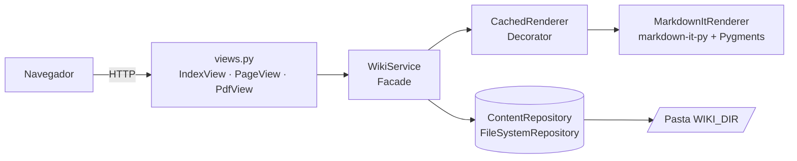
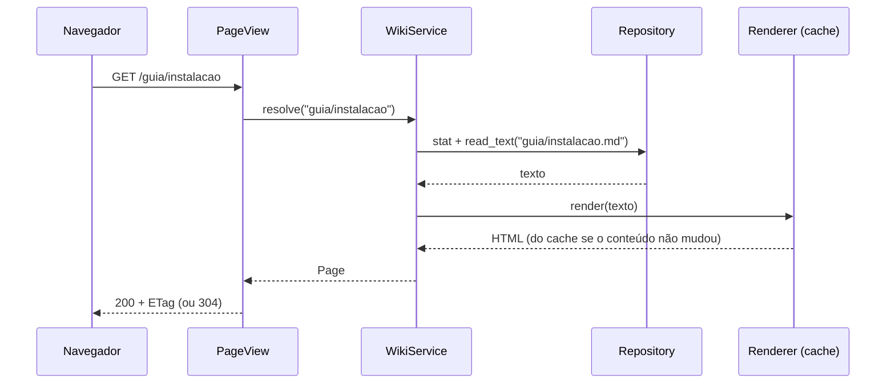

# Arquitetura

## Visão geral

| Módulo          | Responsabilidade |
|-----------------|------------------|
| `config.py`     | `Settings` imutável, lida de `WIKI_*` |
| `app.py`        | *Application factory* e *composition root* |
| `views.py`      | Rotas como *class-based views* (HTTP apenas) |
| `service.py`    | Casos de uso: catálogo, abrir página, resolver download |
| `repository.py` | Acesso ao disco e **segurança de caminhos** |
| `rendering.py`  | Markdown → HTML, realce, âncoras, links `.md` |
| `cache.py`      | Cache LRU thread-safe |
| `security.py`   | CSP e demais cabeçalhos |
| `models.py`     | Objetos de valor (`dataclass` imutáveis) |

## Padrões de projeto

| Padrão               | Onde                                | Por quê |
|----------------------|-------------------------------------|---------|
| Application Factory  | `create_app`                        | Várias instâncias com configurações distintas (testes) |
| Repository           | `ContentRepository`                 | Isola o acesso ao armazenamento e concentra a segurança |
| Strategy             | `Renderer`                          | Motor de Markdown intercambiável |
| Decorator            | `CachedRenderer`                    | Cache sem alterar o renderizador |
| Facade               | `WikiService`                       | Interface única e simples para as rotas |
| Dependency Injection | construtores das views/serviço      | Testes com dublês; sem globais |
| Value Object         | `models.py`                         | Dados imutáveis entre camadas |

## Fluxo de uma requisição

`resolve` tenta primeiro a **página** `nome.md`; se não existir, tenta o **arquivo** `nome`
(download como anexo). Por isso `/guia/instalacao.md` entrega o Markdown original.

## Impressão e PDF

Utilizando o CSS `@media print` o resultado:

- some o que é interface (cabeçalho, rodapé, índice, botões);
- fundo branco e texto preto, independentemente do tema escuro;
- títulos nunca ficam órfãos no fim da página; tabelas, citações e imagens não se partem;
- cabeçalho de tabela repete a cada página; código quebra linha em vez de rolar;
- links externos mostram a URL ao lado do texto.

Como o `<title>` é o título da página, o navegador já sugere esse nome para o arquivo PDF.

## Segurança

- **Path traversal**: `..`, caminhos absolutos, ocultos e links simbólicos que escapam da raiz → 404.
- **Downloads sempre como anexo** (`Content-Disposition: attachment`) + `nosniff`: um `.html` ou `.svg`
  na pasta não executa na origem da wiki.
- **HTML no Markdown escapado** por padrão; links `javascript:` não são gerados.
- **CSP restritiva**: sem scripts/estilos inline, sem formulários, sem *frames*.
- **Container**: usuário sem privilégios, sistema de arquivos somente leitura, sem *capabilities*.
