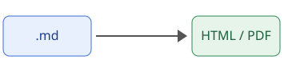

# Bem-vindo à Wiki

Esta pasta é o **conteúdo de demonstração**. Cada arquivo `.md` vira uma página; os demais
arquivos (planilhas, PDFs, imagens…) aparecem no índice como *downloads*.

## Recursos

- Realce de código com Pygments (claro e escuro automáticos);
- Tabelas, ~~tachado~~, citações e listas;
- Links entre páginas: veja a [instalação](guia/instalacao.md) e a [configuração](guia/configuracao.md);
- Botão **Baixar PDF** (usa o `@media print` do navegador) e **Baixar .md**.

## Exemplo de código

```python
from dataclasses import dataclass


@dataclass(frozen=True)
class Ponto:
    x: float
    y: float

    def distancia(self, outro: "Ponto") -> float:
        return ((self.x - outro.x) ** 2 + (self.y - outro.y) ** 2) ** 0.5
```

```bash
docker run --rm -p 5000:5000 -v "$PWD/examples/content:/app/data:ro" wiki
```

## Tabela

| Rota            | O que faz                                |
|-----------------|------------------------------------------|
| `/`             | Índice de páginas e arquivos             |
| `/<nome>`       | Exibe a página (ou baixa o arquivo)      |

> **Dica:** links absolutos, como o do [Pygments](https://pygments.org/), aparecem com a URL
> escrita ao lado quando a página é impressa.

## Imagem



Os dados de exemplo estão em [`dados/vendas.csv`](dados/vendas.csv), que é baixado como anexo.
